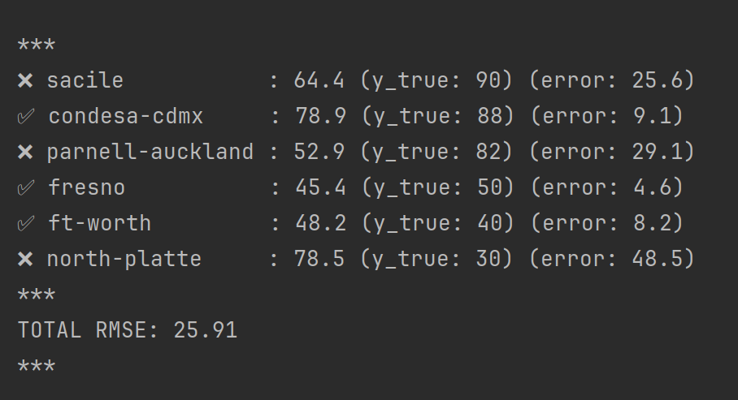
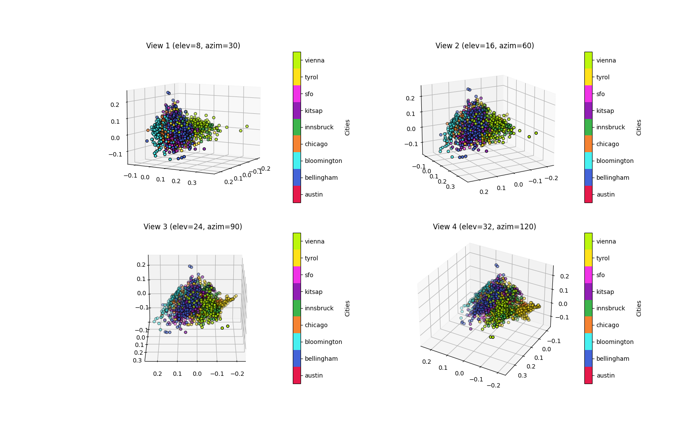

# Aerial Relocation Scores

Let's see if I can make a general purpose aerial imagery vector,
then use it to predict how much I want to live in a place.

#### Contents

1. [Python Setup](#python-setup)
2. [Getting Raw Data](#getting-raw-data)
3. [Generating Our Data](#generating-our-data)
4. [Running the Analysis](#running-the-analysis)

---



---

## Python Setup

This project uses Python 3.12, but it would probably work with other versions of Python 3.

```sh
python3.12 -m venv ./venv/ && \
source ./venv/bin/activate && \
pip install -r requirements.txt
```

## Getting Raw Data

This analysis uses the [Inria Aerial Image Labeling Dataset](https://project.inria.fr/aerialimagelabeling/files/), available at the link on 22 Apr 2024.

1. Download the multipart 7z files by running (or referencing) [`scripts/download-data.sh`](./scripts/download-data.sh)
    * Alternative: `curl -k https://files.inria.fr/aerialimagelabeling/getAerial.sh | bash`
    * But you shouldn't pipe scripts from the internet to your shell.
    * Make sure you're in the `./data/` directory.
2. Run or reference [`scripts/extract-data.sh`](./scripts/extract-data.sh) to extract the archive
3. Carry on

## Generating Our Data

We're going to make little sub-tiles from our images, and associate them with other information (including parent image and image group and a score).

```sh
python scripts/generate-subimages.py
```

## Running the Analysis

You've got your virtual environment, installed the deps, made the data.

```sh
export PYTHONPATH="${PYTHONPATH}:$(pwd)/src"
python src/pca.py && \
python src/train.py && \
python src/eval.py
```

If your results look like mine, they aren't useful.

### Doing better next time

Why didn't this work well?

* Maybe our input data vs training data isn't the same zoom level, color space, etc...
* I'm only extracting color distribution, not the things that actually characterize a place
* Maybe you can't know enough "ground truth" about a place by the way it's built from overhead

If I wanted to try again - better but slower - I could extract features from images like curviness of roads, angles on buildings, rooftop coloration, road size vs building size, etc...

---


